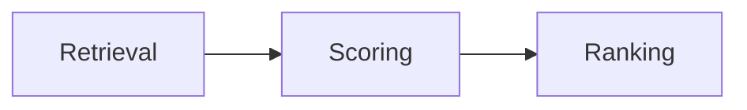

# Wiki Query Skill

Search the wiki, synthesize a cited answer, automatically enrich from the web when
coverage is incomplete, and file the answer back as a new wiki page.

**Trigger**: `/wiki-query <natural language question>`

Examples:
```text
/wiki-query How is Google's experiment framework built?
/wiki-query Compare online vs offline evaluation for ads ranking models.
/wiki-query Which retrieval strategies work best for LLM-based recommendation?
```

## When to use

Use this skill whenever the researcher asks an analytical question about ads
ranking, LLM systems, experiment frameworks, or recommendation systems. It reads
from the accumulated wiki and automatically fetches missing sources, so it works
even on an empty wiki.

## Prerequisites

- `wiki/` and `raw/` directories exist (created by first `/wiki-ingest` if missing)
- `wiki/index.md` is created automatically if missing

---

## Steps

### Step 1 — Index scan (index-first, always)

Read `wiki/index.md`. Identify entries most relevant to the question by matching title,
summary text, and status tags. Select ≤5 candidates.

If `wiki/index.md` does not exist or has no entries, treat this as a **total gap** and
proceed directly to Step 3A.

---

### Step 2 — Page reads

Read the ≤5 selected wiki pages. Extract:

- Factual claims relevant to the question (with their source citations)
- Inferences already labeled in those pages
- Open questions already identified

Do not read more than 5 pages in this step. The ≤5 limit resets if gap-detection
(Step 3) triggers an ingest; the re-query after ingest is a fresh operation with
its own budget.

---

### Step 3 — Gap detection and source enrichment

Assess coverage from Step 2, then automatically fetch and ingest any sources needed
to improve the answer — regardless of whether some pages were already found.

**A. Total gap** (no relevant pages found or wiki is empty):
1. Identify 2–3 external URLs highly relevant to the question using WebSearch.
2. For each URL, fetch using WebFetch. If WebFetch fails: retry once. If still
   failing, try the next candidate URL.
3. For each successfully fetched source, run the full `/wiki-ingest` workflow
   (save to `raw/web/<slug>.md`, create wiki pages, update `wiki/index.md`, log).
4. If at least one source was ingested, re-run this query from Step 1 as a fresh
   operation. If all fetches failed, answer with
   `Open question: <question> — no relevant sources found` and stop.

**B. Partial gap** (some pages found but coverage is incomplete):
1. Identify 1–2 external URLs that fill specific coverage gaps.
2. Fetch and ingest each one using the same procedure as (A) — do not prompt the
   researcher.
3. Proceed to Step 4 using both the originally read pages and any newly created
   wiki pages.

**C. Full coverage** (existing pages fully address the question):
Proceed directly to Step 4.

**Coverage is partial when any of the following are true:**
- The question has a sub-topic for which no wiki page has a relevant claim
- The most recent source cited is >6 months old for a fast-moving topic
- The synthesis would contain more than 2 `Open question:` labels

---

### Step 4 — Synthesis

Write a cited answer using information from the pages read in Step 2 (and any
newly ingested pages from Step 3).

**Citation format:** inline wiki links — `[[wiki/sources/slug.md]]`

**Labeling rules:**
- Factual claims: cite the source page inline — no additional label needed
- Inferences (not directly stated in sources): prefix with `Inference:`
- Unanswerable gaps: prefix with `Open question:`
- Claims from non-peer-reviewed sources: append credibility label, e.g., *(blog post)*

---

### Step 5 — Output format selection

Choose the output format based on the question. Default to prose; layer in visuals wherever they add clarity.

| Trigger | Format | Location |
|---|---|---|
| Default (any question) | Prose markdown page | `wiki/synthesis/<slug>.md` |
| Question contains "compare" or "vs" | Prose + comparison table | `wiki/comparisons/<slug>.md` |
| Numeric data present in sources | matplotlib script | `wiki/assets/<slug>-chart.py` |

**Always consider adding to any synthesis or comparison page:**

- **Markdown tables** — use whenever comparing ≥3 items across ≥2 attributes, or summarizing parameter ranges
- **Graphviz diagrams (preferred)** — use for pipelines, architectures, data flows, decision trees, entity relationships, timelines
- **Mermaid diagrams (fallback)** — same use cases, only when Graphviz isn't suitable

**Graphviz diagram format (preferred):**
1. Write DOT source to `wiki/diagrams/<slug>-diagram-N.dot` (N increments per page, starting at 1)
2. Render it: `uv run python scripts/render_dot.py wiki/diagrams/<slug>-diagram-N.dot`
3. Embed the result in the page: ``

Layout guidance:
- `rankdir=LR` — pipelines, data flows
- `rankdir=TB` with `cluster_<name>` subgraphs — architectures, hierarchies, entity relationships
- `shape=diamond` nodes — decision trees
- Keep node labels short (≤5 words); add a prose caption below the image
- If the `.dot` source is edited later, re-render it so the SVG stays in sync

**Mermaid diagram format (fallback)** — use only if `scripts/render_dot.py` or the
`dot` CLI is unavailable, Graphviz rendering errors out, or the researcher
explicitly asks for an editable Mermaid diagram:

Mermaid diagram types to prefer:
- `flowchart LR` — pipelines, data flows
- `sequenceDiagram` — multi-system interactions
- `classDiagram` — model or schema relationships
- `gantt` — timelines

Fenced code block syntax (rendered by the wiki server):
````

````

**matplotlib chart format** (only when sources contain actual numeric data):
```python
# Generated by /wiki-query — run with: python wiki/assets/<slug>-chart.py
import matplotlib.pyplot as plt
# chart data and rendering
plt.savefig("wiki/assets/<slug>-chart.png")
```
Add a prose note in the page: `*Chart: run `python wiki/assets/<slug>-chart.py` to regenerate.*`
The researcher runs the script to produce the PNG. Do not execute it directly.

---

### Step 6 — File back (automatic)

Write the answer as a new wiki page with full YAML frontmatter:

```yaml
---
title: "..."
type: "synthesis"       # or "comparison" for tables
sources:
  - "<raw-filename-1>"
  - "<raw-filename-2>"
status: "current"
created: "YYYY-MM-DD"
last_updated: "YYYY-MM-DD"
---
```

Add an entry to `wiki/index.md`:
```
- [Title](wiki/synthesis/slug.md) — one-line summary [status: current] [sources: N]
```

---

### Step 7 — Open question cleanup

For each wiki page read in Step 2, check whether its `## Open Questions` section
contains a question that the new synthesis page answers (fully or substantially).

**For each answered open question:**
1. Remove that bullet from the `## Open Questions` list in the source page.
2. Add a wiki link to the new synthesis page in a `## Related Pages` section of the
   source page (create the section if missing).
3. Remove the `## Open Questions` heading if it is now empty.

Partial answers do not qualify — leave those questions in place.

---

### Step 8 — Log entry

Append to `wiki/log.md`:

```
## [YYYY-MM-DD] query | <question summary> | pages-read: N | sources-ingested: N
```

---

## Token budget

- 1 read: `wiki/index.md`
- ≤5 reads: relevant wiki pages
- 0–3 fetches: source enrichment (Step 3A/3B) — each fetch counts as one unit
- Each enrichment ingest: follows `/wiki-ingest` token budget (≤8 reads)
- Total target for query synthesis: ≤7 file reads (excluding enrichment ingests)

If the synthesis budget is exceeded, append a tool-gap observation to
`wiki/meta/evaluations.md`.
