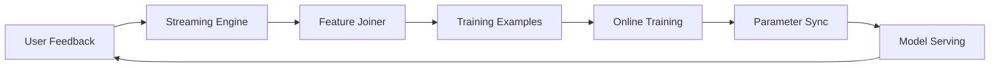

# Online Training for Recommendation Systems

Online training refers to continuously updating a recommendation model on streaming user feedback data, rather than relying solely on periodic batch training cycles. It addresses concept drift — the non-stationary distribution of user behavior — by closing the feedback loop from user action to model update within minutes rather than hours or days.

## Key Components

### Streaming Infrastructure
- Message queues (e.g., Kafka) for user action logs and feature streams
- Stream processing (e.g., Flink) for online feature joining
- On-disk KV cache for late-arriving user actions

### Training Pipeline
- Continuous consumption of streaming training examples
- Single-pass training on fresh data
- Integration with batch training for model architecture changes

### Parameter Synchronization
- Incremental sync of only recently updated parameters to serving infrastructure
- Different sync schedules for sparse (minute-level) vs dense (hour/day-level) parameters
- On-the-fly model updates without serving interruption

## Approaches

| System | Sync Cadence | Sparse Parameters | Fault Tolerance |
|---|---|---|---|
| **Monolith** (ByteDance) | Minute-level (sparse), day-level (dense) | Cuckoo hash + touched-key sync | Daily PS snapshots |
| **FTRL-Proximal** (Google) | Per-coordinate online learning | Feature hashing | Progressive validation |
| **XDL** (Alibaba) | Short-interval sync | Dynamic feature eviction | Checkpoint-based |
| **Persia** (Amazon) | Continuous sync | Hybrid CPU-GPU hash table | Replication-based |

## Benefits

- **Improved model quality**: Live A/B experiments show 14–18% AUC improvement over batch-only training (Monolith paper)
- **Faster adaptation**: Models capture user interest shifts within minutes
- **Tighter feedback loop**: Implicit signals (watch time, skip rate) are incorporated immediately

## Trade-offs

- **Reliability vs. real-time**: Frequent parameter sync increases network/computation overhead; reduced snapshot frequency risks data loss on failure
- **Version inconsistency**: Sparse and dense parameters can be out of sync if updated at different cadences — acceptable when dense variables change slowly
- **Negative sampling bias**: Streaming data has skewed label distributions; requires correction (e.g., log odds correction)

## Related Pages

- [[wiki/entities/monolith-realtime-system.md]] — ByteDance's Monolith system
- [[wiki/sources/monolith-realtime-recommendation-system.md]] — Monolith paper *(peer_reviewed)*
- [[wiki/sources/ad-click-prediction-view-from-the-trenches.md]] — Google's FTRL-Proximal online learning *(peer_reviewed)*
- [[wiki/entities/ftrl-proximal-algorithm.md]] — FTRL-Proximal algorithm
- [[wiki/synthesis/tiktok-recommendation-algorithm.md]] — TikTok's real-time recommendation pipeline
