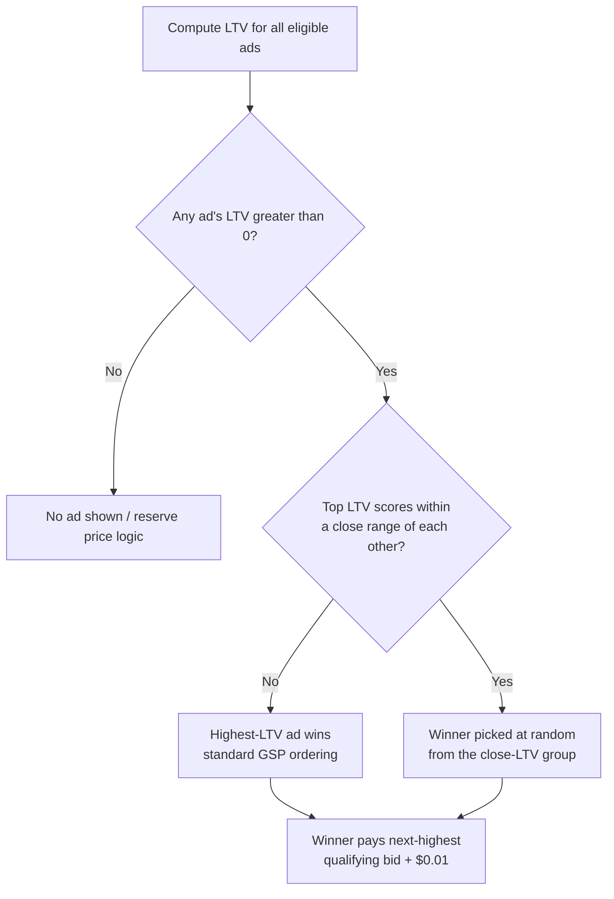

# Randomized Generalized Second-Price Auction (rGSP)

**rGSP** ("Randomized General Second-Price Auction") is the auction mechanism Google has used for Search ads globally **since January 2019**. It is a variant of the [[wiki/concepts/generalized-second-price-auction.md]] mechanism in which the slot winner is not always the single highest-scoring ad — when top bidders' [[wiki/concepts/google-ad-rank-ltv-scoring.md|LTV]] (Ad Rank) scores are close enough, the winner is chosen **at random** from that group. [[wiki/sources/google-ad-rank-briefing.md]]

## How It Works

1. Ads are ranked by **LTV** (`eCPM - costs`, Google's Ad Rank score) — see [[wiki/concepts/google-ad-rank-ltv-scoring.md]].
2. If the top contenders' LTV scores are sufficiently close, Google does **not** deterministically award the slot to the single highest-LTV ad — the winner is selected **at random** from this close-LTV group. *(news article)* [[wiki/sources/rgsp-randomized-second-price-explained.md]]
3. Pricing still follows second-price-plus-epsilon: the winner pays **the next-highest qualifying bid plus $0.01**, regardless of whether that winner was the top-ranked ad or a randomly-selected one from the close group. *(news article)* [[wiki/sources/rgsp-randomized-second-price-explained.md]]

The exact width of the "close enough" LTV band is not publicly documented by Google in either the CMA briefing paper or DOJ trial materials.

## Why Google Introduced It

Per testimony in *US v. Google* (DOJ antitrust trial), Google's stated rationale is to avoid **winner-take-all** dynamics — preventing a single dominant advertiser from permanently occupying top slots across nearly all auctions for a query — and to reduce the frequency with which advertisers must re-tune bids to stay competitive. *(news article)* [[wiki/sources/rgsp-randomized-second-price-explained.md]]

## Effect on Pricing and Revenue

| Claim | Source | Credibility |
|---|---|---|
| Launched globally, January 2019 | [[wiki/sources/google-ad-rank-briefing.md]] | official filing *(other)* |
| Increases Google's ad revenue (per Jerry Dischler testimony) | [[wiki/sources/rgsp-randomized-second-price-explained.md]] | DOJ trial reporting *(news article)* |
| Auction-mechanic changes incl. rGSP raised costs ~5% for average advertisers, up to ~10% for some queries | [[wiki/sources/rgsp-randomized-second-price-explained.md]] | DOJ trial reporting *(news article)* |
| Associated with ~10% overall revenue increase, not tied to quality improvements (DOJ characterization) | [[wiki/sources/rgsp-randomized-second-price-explained.md]] | DOJ trial reporting *(news article)* — litigation claim, not confirmed by Google |

## DOJ Antitrust Trial Findings (US v. Google)

- DOJ's core objection: the highest bidder should always win an auction; randomizing the winner among close-LTV ads is, in DOJ's framing, anticompetitive.
- DOJ claim: advertisers must bid roughly **3.7x** higher than the relevant competitor to reliably avoid being randomized out of the winning position.
- Google does not publish guidance on how advertisers can raise their LTV/Ad Rank score, leaving "increase your bid" as the main lever advertisers can pull directly.
- An internal email from Google VP Adam Juda, cited at trial, reads: *"If I have to say, '[W]e randomly disable you if you don't bid high enough,' then I'm going to have another bad year"* — cited by DOJ as evidence Google understood the practice's competitive implications.

*(news article — DOJ trial reporting)* [[wiki/sources/rgsp-randomized-second-price-explained.md]]

## Relationship to GSP Theory

[[wiki/concepts/generalized-second-price-auction.md]] and [[wiki/synthesis/vickrey-and-gsp.md]] describe GSP's **locally envy-free equilibrium**, in which slot allocation is a deterministic function of (bid × quality). rGSP departs from this assumption in a way the academic GSP literature does not model:

- **Allocation is no longer deterministic** for ads with similar LTV — the same set of bids can produce different winners across auctions.
- **Pricing remains second-price-plus-epsilon**, but the "next-highest bid" used for pricing depends on which ad was randomly selected as winner, adding variance to realized CPCs even when bids are held constant.

*Inference: Because allocation is randomized among close-LTV competitors, the locally-envy-free equilibrium concept (no advertiser wants to swap with an adjacent competitor at that competitor's price) would need to be redefined in expectation over the randomization, rather than for a single deterministic ordering. No source reviewed provides this formal extension.*

## Advertiser Implications

Two levers exist to avoid randomized demotion, per DOJ trial reporting:
1. **Improve LTV** — raise pCTR, pCQ, or pLQ (see [[wiki/concepts/google-ad-rank-ltv-scoring.md]]) — but Google does not document how to do this precisely.
2. **Increase bid** — the only lever advertisers can pull directly and verify the effect of.

*(news article)* [[wiki/sources/rgsp-randomized-second-price-explained.md]]

## Open Questions

- What is the actual width of the "close enough" LTV band that triggers randomization?
- How does Google select the randomization probability distribution across the close-LTV group (uniform? weighted by LTV margin?)
- Has Google published any peer-reviewed or technical documentation of rGSP, or does all public knowledge derive from litigation disclosures?

## Related Pages

- [[wiki/concepts/google-ad-rank-ltv-scoring.md]]
- [[wiki/concepts/generalized-second-price-auction.md]]
- [[wiki/synthesis/vickrey-and-gsp.md]]
- [[wiki/sources/rgsp-randomized-second-price-explained.md]]
- [[wiki/sources/google-ad-rank-briefing.md]]
