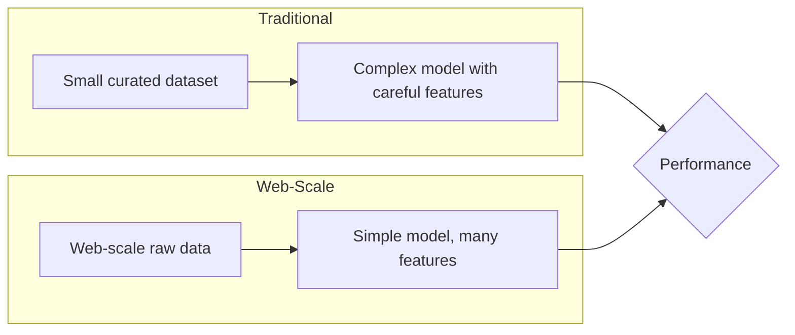
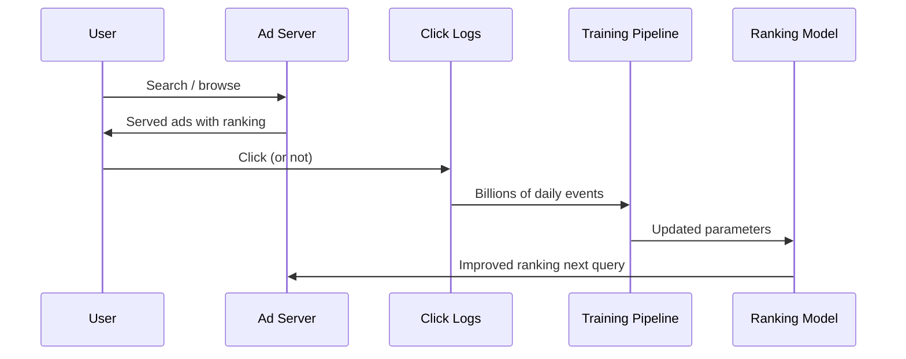

# Web-Scale Learning

**Web-scale learning** is the paradigm of training machine learning systems on naturally occurring large-scale data from the web, rather than relying on carefully curated or manually annotated datasets. The term was popularized by [[wiki/sources/unreasonable-effectiveness-of-data.md]] (Halevy, Norvig & Pereira, 2009).

## Core Thesis

The central claim is that **simple models trained on vast amounts of data outperform complex models trained on limited data**. As stated in the original article: *"Simple models and a lot of data trump more elaborate models based on less data."*

## Key Principles

| Principle | Description | Example |
|---|---|---|
| **Use natural data** | Prefer data that exists "in the wild" over annotated data | Search query logs vs. hand-labeled relevance judgments |
| **Memorize at scale** | With enough data, memorization of specific patterns works | Phrase tables in statistical MT; embedding tables in ads |
| **Threshold effect** | Same algorithm crosses a quality threshold as data volume grows | Scene completion: poor at 10^3, good at 10^6 photos |
| **Feature abundance** | Larger data allows more features without overfitting | Millions of n-gram features in language models |

## Relationship to Ads Ranking

Web-scale learning principles directly shape production ads ranking systems:

- **Click-through data as natural signal**: Every user interaction (impression, click, conversion) generates training data without annotation cost.
- **Wide & shallow architectures**: Google's Wide & Deep model and similar architectures use wide linear models with cross-product features — a direct application of "simple models with many features."
- **Embedding tables**: Learned representations for millions of ads, users, and queries are a form of memorization at scale.
- **Data pipeline investment**: Industry wisdom holds that improving data quality and volume often yields larger gains than improving model architecture — consistent with the web-scale learning thesis.

## Threshold of Sufficient Data

A notable claim from [[wiki/sources/unreasonable-effectiveness-of-data.md]] is that many tasks exhibit a **threshold** beyond which performance sharply improves. For ads ranking:

- Below threshold: models rely heavily on priors, regularization, and feature engineering
- At threshold: raw data volume dominates — simple logistic regression with good features approaches the performance of deep neural networks
- Far above threshold: diminishing returns set in, but even minor modeling improvements compound over billions of predictions

## Limitations and Modern Context

- **Deep learning challenge**: Transformers and large foundation models show that architecture sophistication *does* matter even with web-scale data — partially revising the "simple models" thesis.
- **Data quality vs. quantity**: Web-scale data is noisy; careful filtering, weighting, and debiasing remain essential.
- **Privacy constraints**: The web-scale data that was freely available in 2009 (search logs, click streams) is increasingly restricted by privacy regulations and platform policies.
- **The "Bitter Lesson" connection**: Sutton's "bitter lesson" (2019) echoes this article — the insight that general methods leveraging computation/data ultimately outperform human-crafted knowledge.

## Related Pages

- [[wiki/sources/unreasonable-effectiveness-of-data.md]]
- [[wiki/synthesis/second-price-auction.md]] — auction mechanisms benefit from web-scale experimentation infrastructure
