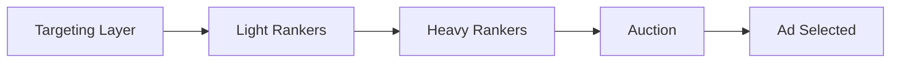

# Contextual Relevance of Ads at Reddit

**Source:** Reddit Engineering Blog (r/RedditEng)
**Authors:** Daniel Peters, Aleksandr Plentsov, Anand Natu
**URL:** https://www.reddit.com/r/RedditEng/comments/1r0hyfu/contextual_relevance_of_ads_reddit/
**Date:** February 9, 2026
**Source type:** `other` (company engineering blog)

---

## Summary

Reddit's engineering team describes their multi-phase effort to improve contextual relevance in ad delivery. The work progressed from IAB taxonomy-based relevance matching, through LLM-labeled ground truth data (using Gemini), to fine-tuned embedding models integrated across the entire delivery funnel.

## Ad Delivery Funnel

Reddit's ad delivery consists of four sequential stages:

1. **Targeting Layer** — Advertiser criteria filters eligible ads
2. **Light Rankers** — Narrow candidate list via fast, lightweight models
3. **Heavy Rankers** — Predict calibrated probabilities for CTR / conversion rate
4. **Auction** — Selects ad maximizing utility: P(outcome) × Value (e.g., pCTR × Bid)

## Methodological Progression

| Phase | Approach | Performance (PRAUC) |
|---|---|---|
| Baseline | IAB taxonomy category match | 1× |
| Pretrained embeddings | Stella (stella_en_400M_v5) cosine similarity | 2.08× |
| Fine-tuned embeddings v1 | Multi-tower model: Stella encoder + subreddit features + landing page summaries | 3.2× (+54% vs pretrained) |

## Key Findings

- **LLM-as-judge** for ground-truth labeling: Gemini 1.5 Flash (now 2.5 Flash Lite) with few-shot prompt; agreement comparable to human inter-labeler alignment; improved via SFT
- **Contextual relevance is non-uniform across user intent**: High-intent users (especially search-referred) benefit disproportionately; passive/low-intent users show worse engagement from relevant ads
- **Auction interventions work**: Filtering non-relevant candidates and utility boosting for relevant ones both improved performance
- **Fine-tuned embeddings** now integrated across targeting, retrieval, and as features in light + heavy rankers

## Placements

Three main categories: Mixed feeds (e.g., Home), Subreddit feeds, and individual Post pages. Posts represent the best opportunity for contextual advertising due to specific, high-signal context.

## Open Questions

- How to break feedback loops and biases in ranker training data?
- When is contextual relevance critical vs. when do other factors dominate?
- How to balance relevance with engagement quality and user trust over the long term?

## Team

Eng: Ted Ni, Andrea Trianni, Alessandro Tiberi, Clement Wong. Product: Looja Tuladhar, Lillian Kravitz. DS: Ryan Sekulic.
