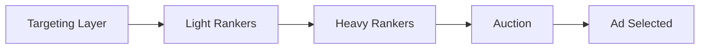

# Contextual Relevance of Ads at Reddit

**Source:** Reddit Engineering Blog (r/RedditEng)
**Authors:** Daniel Peters, Aleksandr Plentsov, Anand Natu
**URL:** https://www.reddit.com/r/RedditEng/comments/1r0hyfu/contextual_relevance_of_ads_reddit/
**Date:** February 9, 2026
**Source type:** `other` (company engineering blog)

---

## Summary

Reddit's engineering team describes their multi-phase effort to improve contextual relevance in ad delivery. The work progressed from IAB taxonomy-based relevance matching, through LLM-labeled ground truth data (using Gemini), to fine-tuned embedding models integrated across the entire delivery funnel.

## Ad Delivery Funnel

Reddit's ad delivery consists of four sequential stages:

1. **Targeting Layer** — Advertiser criteria filters eligible ads
2. **Light Rankers** — Narrow candidate list via fast, lightweight models
3. **Heavy Rankers** — Predict calibrated probabilities for CTR / conversion rate
4. **Auction** — Selects ad maximizing utility: P(outcome) × Value (e.g., pCTR × Bid)

## Methodological Progression

| Phase | Approach | Performance (PRAUC) |
|---|---|---|
| Baseline | IAB taxonomy category match | 1× |
| Pretrained embeddings | Stella (stella_en_400M_v5) cosine similarity | 2.08× |
| Fine-tuned embeddings v1 | Multi-tower model: Stella encoder + subreddit features + landing page summaries | 3.2× (+54% vs pretrained) |

## Key Findings

- **LLM-as-judge** for ground-truth labeling: Gemini 1.5 Flash (now 2.5 Flash Lite) with few-shot prompt; agreement comparable to human inter-labeler alignment; improved via SFT
- **Contextual relevance is non-uniform across user intent**: High-intent users (especially search-referred) benefit disproportionately; passive/low-intent users show worse engagement from relevant ads
- **Auction interventions work**: Filtering non-relevant candidates and utility boosting for relevant ones both improved performance
- **Fine-tuned embeddings** now integrated across targeting, retrieval, and as features in light + heavy rankers

## Placements

Three main categories: Mixed feeds (e.g., Home), Subreddit feeds, and individual Post pages. Posts represent the best opportunity for contextual advertising due to specific, high-signal context.

## Answered Questions

### Feedback loops in ranker training

AI feedback loops arise when rankers retrain on user reactions to their own predictions, amplifying popularity bias and reducing diversity over multiple cycles. Mitigation strategies include in-processing fairness constraints (FADE, FairAgent), self-play frameworks (SPRec) that suppress biased predictions, and simulation-based multi-round auditing. However, only 24 of 347 surveyed papers (2025) validated mitigations in dynamic settings — most fail in the long term [[wiki/sources/contextual-relevance-feedback-trust.md]].

### When contextual relevance is critical

Contextual relevance is critical when: (1) privacy regulations limit behavioral targeting reach, (2) brand safety is paramount (contextual <1% incidents vs behavioral 4-7%), (3) full audience reach is needed (100% vs 40-55% consented), and (4) cost efficiency is the priority (30-40% lower CPM). CTR is within 5-8% of behavioral targeting, while viewability (+10-15%) and user engagement (43% more neural engagement, 2.2x better recall) exceed behavioral. Other factors (price, brand affinity, creative quality) can dominate when they directly address immediate user intent [[wiki/sources/contextual-relevance-feedback-trust.md]].

### Balancing relevance with trust

40% of consumers find ads irrelevant (Bain 2024), and over-targeting drives 22% mobile ad-block adoption. The balance requires: user-centric ad formats (native, non-intrusive), AI-powered contextual targeting that avoids personal data, Acceptable Ads standards, and cross-industry collaboration. Kantar (2024) finds that over-targeting pushes users to offline channels; brands that prioritize context over surveillance build long-term trust and loyalty [[wiki/sources/contextual-relevance-feedback-trust.md]].

## Open Questions

*None remaining.*

## Team

Eng: Ted Ni, Andrea Trianni, Alessandro Tiberi, Clement Wong. Product: Looja Tuladhar, Lillian Kravitz. DS: Ryan Sekulic.
