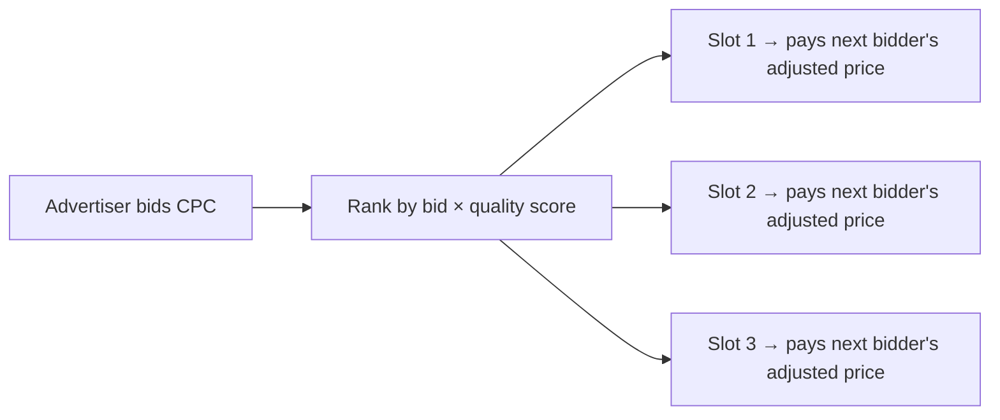

# Internet Advertising and the Generalized Second-Price Auction

**Authors:** Benjamin Edelman (Harvard), Michael Ostrovsky (Stanford), Michael Schwarz (UC Berkeley / NBER)

**Published:** American Economic Review, Vol. 97(1), March 2007, pp. 242–259

**DOI:** [10.1257/aer.97.1.242](https://doi.org/10.1257/aer.97.1.242)

**Source type:** `peer_reviewed`

---

## Summary

This paper formally analyzes the **Generalized Second-Price (GSP) auction**, the mechanism search engines (primarily Google) use to sell keyword-linked ad slots. While GSP is often described as a second-price auction, the authors prove it is fundamentally different from the Vickrey-Clarke-Groves (VCG) mechanism:

- GSP does **not** have an equilibrium in dominant strategies.
- **Truthful bidding is not an equilibrium** of GSP in multi-slot settings.
- Despite this, GSP achieves a **unique locally envy-free equilibrium** (via the corresponding generalized English auction) with payoffs identical to the VCG dominant-strategy outcome.
- GSP equilibria generate **higher revenue** for the platform than VCG, which explains its adoption by search engines over a theoretically cleaner mechanism.

## Mechanism: How GSP Works

Each winner pays the **minimum price needed to hold their slot** — the next competitor's adjusted bid divided by the winner's own quality score.

## Key Claims

| Claim | Status |
|---|---|
| GSP lacks dominant-strategy equilibrium | Proven (counterexample in paper) |
| Truthful bidding is not a Nash equilibrium in GSP | Proven |
| GSP has a unique locally envy-free equilibrium | Proven (via generalized English auction) |
| GSP locally envy-free equilibrium payoffs = VCG payoffs | Proven |
| GSP generates higher revenue than VCG | Proven |

## Theoretical Grounding

The solution concept is **locally envy-free equilibrium**: a state where no advertiser prefers to swap positions with an adjacent competitor at that competitor's current price. This is more realistic than dominant-strategy analysis for the repeated, dynamic bidding environment of search auctions.

## Relevance to Ads Ranking

This paper is the primary academic foundation for understanding why:
- Bid × quality-score ranking is used (not raw bid ranking)
- Winners pay the next competitor's price, not their own bid
- Strategic bidding behavior exists in sponsored search despite the "second price" framing
- Platform revenue can exceed what VCG would generate

## Open Questions

- How do quality score models (ML-based CTR prediction) interact with the equilibrium properties proven here?
- Do the locally envy-free equilibrium results generalize to display/programmatic RTB settings?

## Related Pages

- [[wiki/synthesis/second-price-auction.md]]
- [[wiki/concepts/generalized-second-price-auction.md]]
