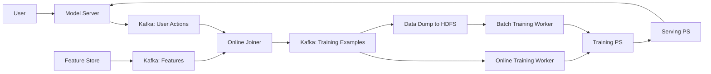

# Monolith: Real Time Recommendation System With Collisionless Embedding Table

**Authors:** Zhuoran Liu, Leqi Zou, Xuan Zou, Caihua Wang, Biao Zhang, Da Tang, Bolin Zhu, Yijie Zhu, Peng Wu, Ke Wang, Youlong Cheng (ByteDance)

**Venue:** ORSUM@ACM RecSys 2022

**DOI:** [10.48550/arXiv.2209.07663](https://doi.org/10.48550/arXiv.2209.07663)

**Source type:** `peer_reviewed`

---

## Summary

Monolith is a large-scale real-time recommendation system developed by ByteDance to address two fundamental challenges in production recommendation: (1) sparse, categorical, dynamically changing features that cause embedding table collisions when using fixed-size hash tables, and (2) non-stationary data distributions (concept drift) that degrade model quality when training and serving are decoupled. The paper presents three main contributions: a collisionless embedding table using Cuckoo hashing with frequency filtering and expirable embeddings, a production-ready online training architecture with high fault tolerance, and a demonstration that system reliability can be traded off for real-time learning.

## Key Findings

### Collisionless Embedding Tables

- Standard hashing tricks cause embedding collisions that degrade model quality. On MovieLens, collision rates of 7.73% (users) and 2.86% (movies) measurably reduced AUC.
- A Cuckoo HashMap-based implementation supports worst-case O(1) lookups and amortized O(1) insertions with no collisions.
- Memory optimization: frequency filtering (only admit IDs above an occurrence threshold) and expirable embeddings (TTL-based eviction for stale IDs).

### Online Training Architecture

- Two-stage training: batch training for historical data (single pass), then continuous online training on real-time streaming data.
- Streaming engine using Kafka + Flink for feature joining; handles out-of-order user actions via in-memory cache backed by on-disk KV storage.
- Log odds correction applied during serving to debias negative sampling.

### Parameter Synchronization

- Incremental on-the-fly sync: only sparse parameters for recently "touched" IDs are transferred from training PS to serving PS at minute-level intervals.
- Dense parameters synced less frequently (day-level) — negligible quality loss since dense variables change more slowly.
- This design dramatically reduces network I/O compared to full-model transfer.

### Fault Tolerance

- Daily snapshot of training PS (instead of more frequent schedules).
- Analysis: with 0.01% daily PS failure rate across 1,000 shards, losing 1 day's updates from 15,000 users (of 15M DAU) every 10 days has negligible impact.
- This trade-off between reliability and real-time learning proved robust in production.

### Performance

- Collisionless embedding outperformed collision-based tables across epochs and time shifts with no overfitting.
- Criteo AUC: 30min sync (79.80) > 1hr sync (79.78) > 5hr sync (79.66) > batch-only (~79.43).
- Live A/B test on an ads model: online training improved AUC by 14–18% over batch training across 7 days.

## Entities and Concepts

- [[wiki/entities/monolith-realtime-system.md]] — Monolith system entity
- [[wiki/concepts/collisionless-embedding-table.md]] — collisionless embedding with Cuckoo hashing
- [[wiki/concepts/online-training-recommendation.md]] — online training for recommendation systems

## Related Pages

- [[wiki/sources/tiktok-unsupervised-algorithm-deep-dive.md]] — blog post referencing Monolith *(blog post)*
- [[wiki/synthesis/tiktok-recommendation-algorithm.md]] — TikTok recommendation pipeline that uses Monolith-like real-time training
- [[wiki/sources/ad-click-prediction-view-from-the-trenches.md]] — Google's online learning system for CTR prediction *(peer_reviewed)*
