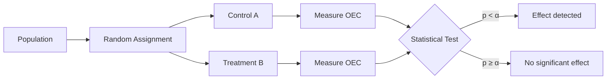
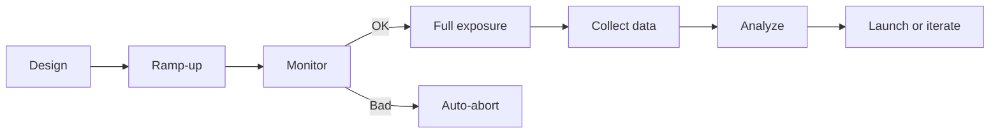
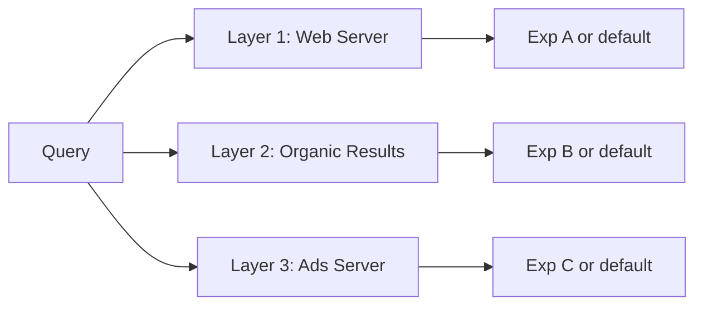

# How A/B Tests Work

A/B testing (also called randomized controlled experiments, split tests, or online controlled experiments) is the gold-standard method for establishing causality between a change and its effect on user-observable behavior. The core idea: randomly split users into two groups, expose one group to a change (treatment) while keeping the other as control, then compare outcomes statistically.

## Core Methodology

### Randomization

The critical requirement is that assignment must be genuinely random — no factor can influence which group a user enters [[wiki/sources/overlapping-experiment-infrastructure.md]] *(peer_reviewed)*. Randomization ensures that, on average, the only systematic difference between groups is the treatment itself, enabling causal inference.

Common randomization units:
- **User / cookie**: consistent experience across sessions; most common
- **Cookie-day**: rotates assignment daily to detect learning effects
- **Session**: per-visit randomization
- **Request**: per-impression randomization (least consistent)

The randomization unit determines the statistical analysis unit — observations at the randomization level are treated as independent [[wiki/sources/overlapping-experiment-infrastructure.md]].

### Metrics and the OEC

The **Overall Evaluation Criterion (OEC)** is the primary metric used to judge success. It should capture the organization's long-term objectives while being measurable in short-term experiments. Example OECs [[wiki/sources/overlapping-experiment-infrastructure.md]]:
- CTR or conversion rate for ads
- Sessions per user for engagement
- Revenue per user for monetization
- A weighted combination of multiple objectives

The OEC must be agreed upon before the experiment starts. Organizations should define secondary metrics for debugging and diagnostics, but a single primary OEC avoids the multiple-comparison problem at decision time.

## Statistical Foundation

### Hypothesis Testing

A/B tests evaluate whether the treatment produces a statistically significant difference from control:

- **Null hypothesis (H₀)**: No difference between variants
- **Alternative hypothesis (H₁)**: A real difference exists

The **t-test** is the standard test for comparing means. For large samples (common in online experiments), the Central Limit Theorem ensures the sample mean is approximately normal.

### Key Concepts

| Concept | Definition | Typical Value |
|---|---|---|
| **Confidence level** (1 − α) | Probability of not making a Type I error | 95% |
| **Significance level** (α) | Probability of false positive (rejecting H₀ when true) | 5% |
| **Statistical power** (1 − β) | Probability of detecting a real effect | 80–95% |
| **Minimum detectable effect** (MDE) | Smallest effect size worth detecting | Varies |
| **p-value** | Probability of observing data this extreme if H₀ is true | < α → reject H₀ |

### Sample Size

Required sample size depends on: confidence level, power, variability of the OEC, and the minimum detectable effect. The core relationship:

For ratio metrics (e.g., CTR = clicks / impressions), the **delta method** is used to compute variances correctly — cookie-mod experiments require more traffic than random-traffic experiments for the same effect size because queries from the same user are correlated [[wiki/sources/overlapping-experiment-infrastructure.md]].

## Execution

### Ramp-up and Auto-abort

Best practice: ramp exposure gradually — start at 1%, monitor metrics in near-real-time, then increase. If the treatment performs significantly worse, auto-abort (reduce to 0%). This limits risk and enables bolder experimentation [[wiki/sources/overlapping-experiment-infrastructure.md]].

After ramp-up, maximize power by assigning 50% of users to each variant.

### Duration

Run for at least one full weekly cycle (7 days) to capture day-of-week effects. Continue longer when:
- The effect is expected to be small
- Novelty effects may distort early results
- Low-traffic segments need sufficient samples

### Pre-period and Post-period

- **Pre-period**: same users diverted but serving unchanged — validates traffic is unbiased
- **Post-period**: continues after experiment ends — detects learned behavior changes

## Validation and Trust

### A/A Tests (Null Tests)

Run continuous A/A tests in parallel with experiments: both groups see the same experience. At α = 0.05, ~5% of metrics should show significance. Deviations indicate bias in the experiment system (e.g., sample ratio mismatch, instrumentation errors). A/A tests also calibrate variance estimates for sample size calculations.

### Sample Ratio Mismatch (SRM)

A statistical test checks whether the actual traffic split matches the expected ratio. A significant mismatch indicates systematic bias — the experiment results should not be trusted.

### Data Validation

Check for:
- Consistent logging across variants
- No unexpected data loss at any pipeline stage
- Data-quality metrics the experiment shouldn't affect (e.g., cache hit rate)
- Stability of metrics over time (visualize control and treatment time series)

## Variance Reduction

### CUPED (Controlled Experiments Using Pre-Experiment Data)

CUPED uses pre-experiment data as a covariate to reduce metric variance. The technique computes a transformed metric using the pre-experiment period, yielding variance proportional to (1 − ρ²) where ρ is the correlation between pre- and during-experiment values. This can substantially reduce required sample size.

### Triggering

Only analyze users who were actually exposed to the treatment (the "triggered" set). Users who never encounter the change add noise. The control must log **counter-factuals** — recording when the treatment would have triggered had the user been in the treatment group. Restricting to the triggered subset removes dilution and improves statistical power [[wiki/sources/overlapping-experiment-infrastructure.md]].

## At Scale: Layered Experiments

When thousands of experiments run simultaneously (as at Google, Microsoft, Meta, LinkedIn), a single experiment layer is insufficient. **Overlapping experiment infrastructure** [[wiki/sources/overlapping-experiment-infrastructure.md]] *(peer_reviewed)* solves this:

Key concepts:
- **Domain**: a traffic segmentation
- **Layer**: a subset of system parameters; experiments in different layers modify disjoint parameters
- **Diversion**: cookie modulo with layer ID incorporated into the hash, ensuring orthogonality
- **Launch layers**: for gradual rollouts; provide alternative defaults without disturbing experiment layers

Each query can simultaneously be in N experiments (one per layer), enabling massive parallelism without interference.

## Common Pitfalls

| Pitfall | Impact | Mitigation |
|---|---|---|
| **Peeking** | Inflates Type I error — p-values fluctuate during data collection | Use sequential testing methods or fix sample size in advance |
| **Underpowered experiments** | Fails to detect real effects | Calculate required sample size; use variance reduction |
| **Novelty effects** | Early results differ from long-term | Run long enough; use post-periods |
| **Primacy effects** | Existing users resist change | Segment new vs. returning users |
| **Simpson's paradox** | Aggregate result reverses when sliced | Pre-specify important segments; use analysis tool with slicing |
| **Multiple comparisons** | Spurious significance across many metrics | Use a single OEC; mark diagnostic metrics at stricter thresholds (e.g., p < 0.001) |
| **Carryover effects** | Treatment affects future behavior | Use appropriate randomization unit; cross-over designs |

## Relationship to Ads Ranking

A/B testing is how ads ranking systems evolve incrementally. Every change — a new model architecture, feature, auction parameter, or relevance embedding — is validated through controlled experiments before launch. The CTR prediction algorithm, learning rates, and other model parameters are explicitly tested through this infrastructure [[wiki/sources/overlapping-experiment-infrastructure.md]]. Triggering and counter-factual logging are particularly important for ads where the treatment may only affect a subset of queries.

## Open Questions

- Can sequential testing methods (e.g., always-valid p-values, Bayesian approaches) fully replace fixed-horizon designs without sacrificing power?
- How should experiments account for interference between users in social/network settings (e.g., a change to one user's experience affects their interactions with others)?
