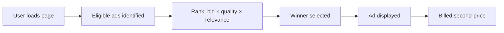

# How Reddit Ads Work

Reddit's advertising system runs a real-time auction every time a user loads a page with ad inventory — deciding which ad fills each slot within milliseconds, billions of times per day.

## The Auction

Reddit uses a **second-price auction** — you set a maximum bid but pay just above the next-highest bidder. The winner is determined by a combination of factors, not just bid amount [[wiki/sources/reddit-ads-how-it-works.md]] *(blog post)*:

| Factor | Description |
|---|---|
| **Bid amount** | Maximum you're willing to pay per click, impression, or view |
| **Ad quality** | Historical CTR and engagement performance |
| **Relevance** | How well targeting matches the user |
| **User experience** | Ads delivering value rank higher |

## The 4-Step Delivery Pipeline

### Step 1: Campaign Setup
Campaign → Ad Group → Ads hierarchy. All targeting at Ad Group level [[wiki/sources/reddit-audience-targeting.md]].

### Step 2: Targeting

Reddit's key differentiator is **community-based targeting** — reaching users through the subreddits they actively participate in.

| Targeting type | Signal | Best for |
|---|---|---|
| **Community** | Subreddit subscription/engagement | Highest intent, specific products |
| **Interest** | Cross-Reddit behavioral clusters | Awareness, broad reach |
| **Keyword** | Real-time conversation content | Lower-funnel, purchase intent |
| **Custom audiences** | CRM lists, Pixel/CAPI retargeting, lookalikes | Conversion, retargeting |

**Logic**: OR within a type (user matches ANY selected community); AND across types (user must match community AND keyword). [[wiki/sources/reddit-audience-targeting.md]]

### Step 3: Bidding

| Strategy | How it works |
|---|---|
| **Manual bidding** | Set specific max bids per action |
| **Automatic bidding** | Reddit optimizes bids within budget |
| **MAX Campaigns** (2026) | AI predicts impression value; auto-selects creative, placements, budget allocation |

MAX Campaigns, launched in beta January 2026, use **Reddit Community Intelligence** — structured signals from 23B+ posts and comments — to predict the value of every impression in real-time. Results from 600+ beta testers: 17% lower CPA, 27% more conversions. [[wiki/sources/reddit-max-campaigns.md]]

### Step 4: Delivery & Learning

- **Learning phase**: 7–14 days for data accumulation. Avoid major changes during this period.
- **Pacing**: Standard (even spread) or Accelerated (fast as possible).
- **Conversion optimization**: Reddit Pixel tracks actions; algorithm shifts delivery toward high-converting audiences.

## Pricing

| Pricing model | Use case |
|---|---|
| **CPM** (cost per 1,000 impressions) | Awareness, reach |
| **CPC** (cost per click) | Traffic, consideration |
| **CPV** (cost per view) | Video awareness |

**Typical costs (2025-2026)**:

| Metric | Range |
|---|---|
| CPM | $0.50 – $15.00 |
| CPC | $0.20 – $4.00 |
| CPV | $0.03 – $0.20 |
| Min daily budget | $5.00 (effective: $50-100/day) |

Reddit is significantly cheaper than Meta and Google — CPMs are typically 50-70% lower than Facebook, and CPCs 30-50% lower.

## Key Differences from Other Platforms

| Dimension | Reddit | Meta ([[wiki/synthesis/meta-ad-ranking.md]]) | Google ([[wiki/concepts/google-ad-rank-ltv-scoring.md]]) |
|---|---|---|---|
| **Auction type** | Second-price | GSP (Bid × EAR + Ad Quality) | rGSP (LTV = eCPM - costs) |
| **Primary targeting** | Community/subreddit | Creative-as-targeting (Andromeda) | Keyword + quality score |
| **Audience intent** | Research/consideration | Entertainment/social | High purchase intent |
| **AI automation** | MAX Campaigns (beta) | GEM → Lattice teacher-student | Smart Bidding |
| **Learning phase** | 7-14 days | 50 events in 7 days | Depends on conversion volume |
| **Typical CPM** | $2-5 | $8-15 | N/A (CPC model) |

## Open Questions

- Will Max Campaigns follow the same trajectory as Meta's Advantage+ — becoming the default and eventually the only path forward?
- How does Reddit's conversation velocity signal (quality engagement weighting) interact with the second-price auction in practice?
- Can Reddit's community-based targeting scale to match Meta and Google's reach without diluting intent signals?
