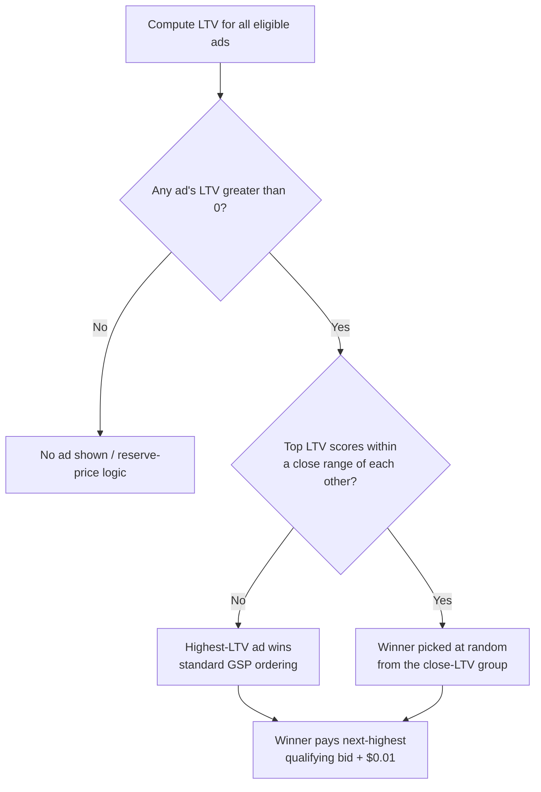

# What Is rGSP?

**rGSP** ("Randomized General Second-Price Auction") is the auction mechanism Google has used for Search ads worldwide since **January 2019**. It's a variant of the [[wiki/concepts/generalized-second-price-auction.md]] (GSP) — the standard multi-slot auction used in search advertising — with one key difference: **the slot winner is not always the single highest-scoring ad**. When the top contenders' scores are close enough, Google picks the winner **at random** from that group. [[wiki/sources/google-ad-rank-briefing.md]]

## From GSP to rGSP

In textbook GSP ([[wiki/synthesis/vickrey-and-gsp.md]]), ads are ranked deterministically by `bid × quality score`, and each winner pays the minimum needed to hold their slot above the next competitor. Google's production system replaces the simple `bid × quality` formula with an **LTV (Long-Term Value) score** — see [[wiki/concepts/google-ad-rank-ltv-scoring.md]]:

```
LTV = eCPM - (impression cost + click cost)
where eCPM = bid × pCTR
```

rGSP layers randomization on top of this LTV-based ranking.

## How rGSP Works



1. **Rank by LTV.** Ads are scored by LTV, exactly as in Google's standard Ad Rank system.
2. **Check for close competitors.** If the top contenders' LTV scores fall within a close range of each other, Google does not automatically hand the slot to the single highest-LTV ad.
3. **Randomize the winner.** Instead, the winner is selected **at random** from that close-LTV group. *(news article)* [[wiki/sources/rgsp-randomized-second-price-explained.md]]
4. **Price as second-price-plus-epsilon.** Regardless of which ad in the group wins, the winner pays **the next-highest qualifying bid plus $0.01** — the same second-price-plus-epsilon rule as standard GSP, just applied to whichever bid ends up as runner-up after randomization. *(news article)* [[wiki/sources/rgsp-randomized-second-price-explained.md]]

The exact width of the "close enough" LTV band, and the probability distribution used to pick among the close-LTV group, are **not publicly documented** — Google's own CMA briefing paper (2020) names rGSP but states it does not detail the randomization logic. [[wiki/sources/google-ad-rank-briefing.md]]

## Why Google Introduced It

Per testimony in the *US v. Google* DOJ antitrust trial, Google's stated rationale is to avoid **winner-take-all** dynamics — preventing one dominant advertiser (the example cited at trial was Amazon) from permanently occupying the top slot for a query — and to reduce how often advertisers must re-tune bids just to stay competitive. *(news article)* [[wiki/sources/rgsp-randomized-second-price-explained.md]]

## Effect on Pricing and Revenue

| Claim | Detail | Credibility |
|---|---|---|
| Launch date | Globally, January 2019 | official filing *(other)* |
| Revenue effect | Google VP Jerry Dischler testified rGSP "increases Google's ad revenue" | DOJ trial reporting *(news article)* |
| Cost increase | Auction-mechanic changes incl. rGSP raised average advertiser costs ~5%, up to ~10% for some queries | DOJ trial reporting *(news article)* |
| Aggregate impact | Associated with ~10% overall revenue increase the DOJ characterized as unrelated to ad-quality improvements | DOJ trial reporting *(news article)* — litigation claim |

## DOJ Antitrust Controversy

The DOJ argued at trial that rGSP is anticompetitive: in a "fair" auction the highest bidder should always win, but rGSP's randomization means the same set of bids can produce different winners across auctions. The DOJ's headline finding: advertisers must bid roughly **3.7x** higher than the relevant competitor to reliably avoid being randomized out of the winning position — and because Google does not publish guidance on how to raise an LTV/Ad Rank score, "bid higher" is the only lever advertisers can verify works. An internal email from Google VP Adam Juda, surfaced at trial, read: *"If I have to say, '[W]e randomly disable you if you don't bid high enough,' then I'm going to have another bad year."* *(news article)* [[wiki/sources/rgsp-randomized-second-price-explained.md]]

## How rGSP Breaks the Standard GSP Equilibrium Story

The classical GSP result ([[wiki/sources/edelman-ostrovsky-schwarz-gsp-auction.md]], [[wiki/concepts/generalized-second-price-auction.md]]) is that GSP has a **locally envy-free equilibrium** — a deterministic allocation where no advertiser wants to swap slots with an adjacent competitor at that competitor's price, yielding VCG-equivalent payoffs at higher platform revenue.

*Inference: rGSP's randomization among close-LTV bidders means the allocation is no longer a deterministic function of bids — the same bid profile can yield different winners, and the realized price (next-highest bid + $0.01) varies with which ad was randomly selected. The locally-envy-free equilibrium concept would need to be redefined "in expectation" over this randomization. No source reviewed for this answer provides that formal extension — it remains an open question in the academic literature applied to Google's production system.*

## Practical Takeaway for Advertisers

Two levers exist to avoid randomized demotion, per DOJ trial reporting:

1. **Improve LTV** — raise predicted CTR, creative quality, or landing-page quality (see [[wiki/concepts/google-ad-rank-ltv-scoring.md]]) — but Google does not document precisely how to do this.
2. **Increase the bid** — the only lever advertisers can pull directly and verify.

*(news article)* [[wiki/sources/rgsp-randomized-second-price-explained.md]]

## Open Questions

- What is the actual width of the "close enough" LTV band that triggers randomization?
- What probability distribution does Google use across the close-LTV group (uniform vs. weighted by LTV margin)?
- Has Google published any technical documentation of rGSP outside of litigation disclosures?

## Related Pages

- [[wiki/concepts/randomized-gsp-rgsp.md]]
- [[wiki/concepts/google-ad-rank-ltv-scoring.md]]
- [[wiki/concepts/generalized-second-price-auction.md]]
- [[wiki/synthesis/vickrey-and-gsp.md]]
- [[wiki/sources/rgsp-randomized-second-price-explained.md]]
- [[wiki/sources/google-ad-rank-briefing.md]]
